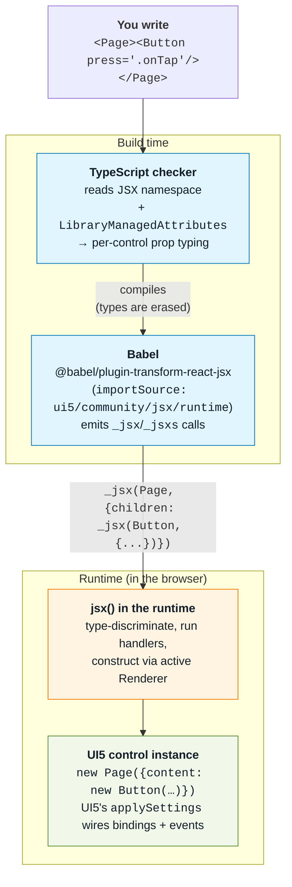

# What is JSX Runtime for UI5?

Write UI5 views as JSX — `.tsx` for the full TypeScript experience
(per-control prop typing, checked bindings and events), or plain
`.jsx` when you don't want TypeScript. Babel turns your JSX into
`_jsx(Control, settings)` calls, and this runtime turns those into
plain `new Control(settings)`, the same shape UI5's XMLView produces
at the end of its parse pipeline.

The runtime itself is identical either way — it operates on the
`_jsx()` calls Babel emits, which are the same for `.tsx` and `.jsx`.
TypeScript only adds author-time type checking on top; drop it and
everything below still works.

Everything downstream is UI5 exactly as before: metadata,
`applySettings`, bindings, aggregations, events. There is no
virtual DOM, no reconciler, no re-render loop. **A JSX
expression is a constructor call, not a render description.**
Reactivity comes from [UI5 bindings](#/learn/data-binding), same
as in an XML view.

## How it works

Three layers, each doing one job. Type checker keeps you honest
at author time. Babel emits calls. Runtime hands them to UI5.

## Ready?

[Your first TSX view](#/learn/first-view) shows the whole story
in ten lines of code. Then [Setup](#/learn/setup) wires the
build.
