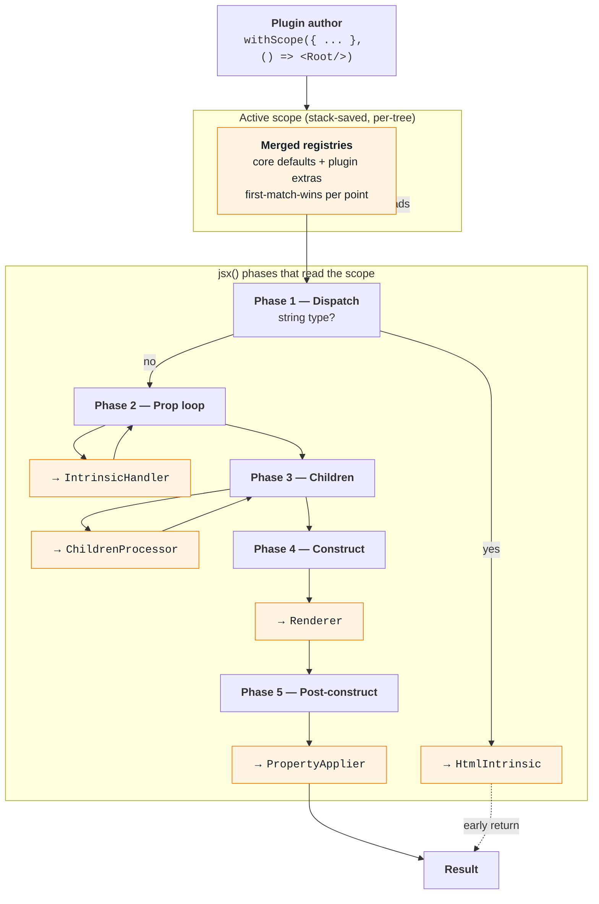

# The Plugin SPI

Five extension points. Any of them can be extended by a plain
module (a plugin) with no core changes. See the phases they
plug into in [Runtime anatomy](/#/learn/runtime-anatomy).

## Opt-in

A consumer opens a **scope** around a JSX subtree:

```tsx
import { withScope } from "ui5/community/jsx/runtime/jsx-runtime";
import { switchProcessor } from "ui5/community/jsx/runtime/plugins/switch/index";

return withScope({ childrenProcessors: [switchProcessor] }, () => (
    <VBox>
        <Switch on={{ path: "/kind" }}>...</Switch>
    </VBox>
));
```

`withScope` registers the plugin's extras for the synchronous
JSX construction, then restores the previous scope. Apps that
don't import the plugin pay zero runtime cost. Nested
`withScope` calls merge; innermost wins on first-match-wins
ordering.

## The five extension points



**`HtmlIntrinsic`.** One per scope. Runs in phase 1 when `type`
is a string (`<div/>`, `<svg/>`). Returns the UI5 control that
represents that HTML element. Default builds `sap.ui.core.HTML`
wrappers.

**`IntrinsicHandler`.** Many per scope, first-match-wins. Runs
in phase 2 for every `(key, value)` prop. Claims by key name
and/or value shape; transforms the settings entry and/or
schedules a post-construct hook. Core handlers cover `class`,
`ref`, `binding`/`bindElement`, dot-handler event strings, and
[property type coercion](/#/learn/type-coercion).

**`ChildrenProcessor`.** Many per scope, first-match-wins. Runs
in phase 3 for every JSX child. Claims a child (usually a
plugin-defined sentinel) and emits replacement entries. Core
processors handle `<Fragment>`, `<For>`, `<If>`. The shipped
`switchProcessor` is a full working example; see
[Case study](/#/learn/switch-plugin).

**`Renderer`.** One per scope. Runs in phase 4. `construct(type,
settings)` returns the instance. Default: `new type(settings)`.
A plugin might return an XML string (for the `sap.ui.fl`
pipeline), a `RenderManager` thunk, or a captured factory.

**`PropertyApplier`.** Many per scope, first-match-wins. Runs
in phase 5 with the live instance. Useful for `Promise`-valued
props or late-binding logic that needs the constructed control.

## Sentinels

Plugins define their own JSX tags with `defineSentinel<P>(name)`:

```ts
export const Switch = defineSentinel<{
    on: string | number | boolean | { path: string };
    children?: unknown;
}>("Switch");
```

`<Switch on={...}>` becomes a sentinel node
(`{ __ui5JsxSentinel: true, tag: Switch, props: {...} }`) that
the plugin's `ChildrenProcessor` recognises. The runtime
doesn't know what `<Switch>` means; the plugin does. Without
`withScope`, the sentinel throws a clear "unknown sentinel"
error at construction time.

The type parameter `P` declares the accepted props, so
`<Switch onn={...}/>` is a TypeScript error before it hits the
runtime.

## Library-agnostic by construction

A well-formed plugin has **zero** imports from `sap.m` or any
other UI library. `<Switch>` doesn't ship a control; it binds
`visible` on whichever child the author places inside. That's
why the plugin can ship in the runtime package: it has no
library dependency to declare.

Walk through a working plugin end to end:
[Case study: <Switch>](/#/learn/switch-plugin).
