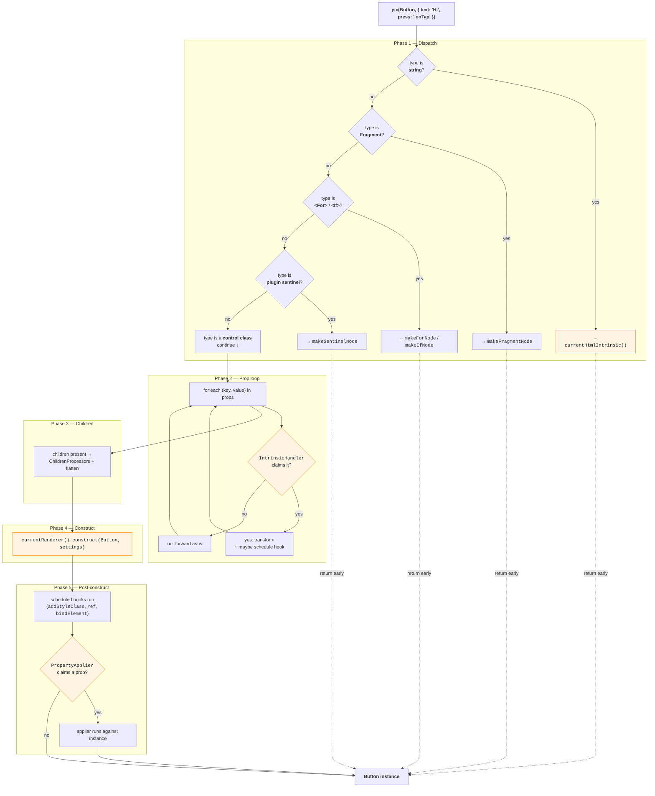

# Runtime anatomy

What happens between `_jsx(Button, {...})` and
`new Button({...})`. Five phases, in order.

## The five phases



## Phase 1: Dispatch

Figure out what `type` is:

- **string** (`"div"`) → hand off to `currentHtmlIntrinsic()`.
- **Fragment sentinel** (`<>…</>`) → marker node for the
  children pipeline.
- **`<For>`, `<If>`** → directive nodes for the children pipeline.
- **Plugin sentinel** (created by `defineSentinel<P>()`) →
  marker for a plugin's `ChildrenProcessor`.
- **Control class** → continue.

## Phase 2: Prop loop

For every `(key, value)` in props, ask each registered
`IntrinsicHandler` whether it claims it. First match wins. A
claimed handler transforms the entry (removing it from
settings, scheduling a post-construct hook, or both). Unclaimed
props flow to UI5's `applySettings`.

Core handlers: `class`, `ref`, `binding`/`bindElement`,
dot-handler event strings, and property type coercion.

## Phase 3: Children

Three passes:

1. `flattenSentinelLevel`: unwrap one layer of `<Fragment>`
   and arrays so directives surface.
2. `processChildren`: each child gets offered to the
   registered `ChildrenProcessor`s. First match wins.
3. `flattenChildren`: final cleanup. Drop `null`/`undefined`/
   `false`/`""`; resolve literal `<If>`; recursively unwrap.

Result: a clean list of UI5 controls ready for an aggregation.

## Phase 4: Construct

Hand `type` and `settings` to the active `Renderer`:

```
currentRenderer().construct(type, settings)
```

Default renderer: `new type(settings)`. A plugin renderer might
emit an XML string, a `RenderManager` thunk, or a captured
factory.

## Phase 5: Post-construct

With the instance in hand:

- Run scheduled hooks: `addStyleClass()` (from `class=`),
  `ref(instance)` (from `ref=`), `bindElement()` (from `binding=`).
- Offer each remaining prop to registered `PropertyApplier`s,
  useful when the prop needs the live instance (Promise-valued
  props, late-binding).

## Why this shape

Every phase reads from the active `Scope`. A [plugin](#/learn/plugin-spi)
adds its handler / processor / renderer / applier at
scope-open time, and the phase machinery consults the merged
registry. Bindings still route through `applySettings` in phase
4. The runtime never invents its own binding path.
